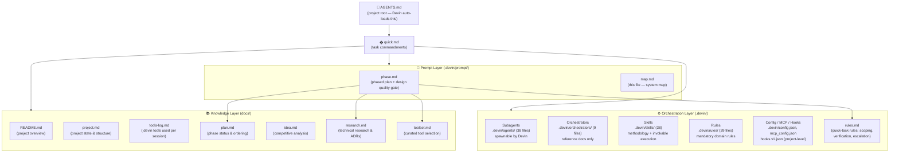
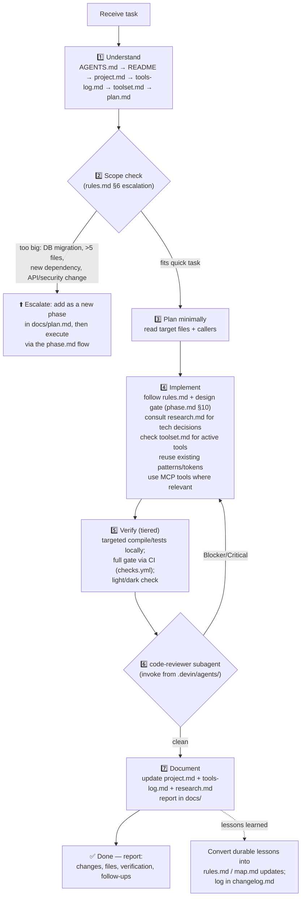
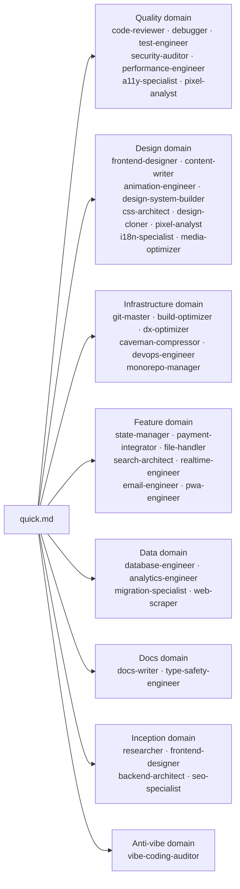

# System Map — How the Prompt System Connects

Referenced by `quick.md` (point 3) and `AGENTS.md` (project root). Everything flows from `AGENTS.md` — Devin loads it automatically at every session start, and it points here. Read the system in the order defined below before starting any task.

## 0. Visual Overview

```
                                ┌─────────────────────┐
                                │     AGENTS.md       │  ← DEVIN ENTRY POINT
                                │  (auto-loaded by    │     (project root)
                                │   Devin at startup) │
                                └──────────┬──────────┘
                                           │ points to
                                           ▼
                                ┌─────────────────────┐
                                │      quick.md       │  ← TASK ENTRY POINT
                                │  (task commandments) │     (.devin/prompt/)
                                └──────────┬──────────┘
                                           │
        ┌──────────────────┬───────────────┼────────────────┬─────────────────┐
        ▼                  ▼               ▼                ▼                 ▼
┌───────────────┐  ┌──────────────┐  ┌─────────────┐  ┌─────────────┐  ┌──────────────┐
│  ORCHESTRATION │  │    PROMPT    │  │    RULES    │  │  KNOWLEDGE  │  │    AGENTS    │
│   (.devin/)    │  │   LAYER      │  │   LAYER     │  │  LAYER      │  │   & SKILLS   │
├───────────────┤  ├──────────────┤  ├─────────────┤  ├─────────────┤  ├──────────────┤
│ agents/ (38)  │  │ phase.md     │  │ rules.md    │  │ README.md   │  │ agents/ (38) │
│ orchestrators│  │ (phased plan │  │ (quick-task │  │ project.md  │  │ skills/ (38)  │
│   / (9)       │  │  + design    │  │  rules)     │  │ tools-log.md│  │ rules/ (39)  │
│ prompt/ (6)   │  │  gate)       │  │             │  │ plan.md     │  │              │
│ skills/ (38)  │  │ map.md (you  │  │             │  │ idea.md     │  │              │
│ rules/ (39)   │  │  are here)   │  │             │  │ research.md │  │              │
│ config.json   │  │              │  │             │  │ CONCEPTS.md │  │              │
│ mcp_config   │  │              │  │             │  │ toolset.md  │  │              │
│ hooks.v1.json │  │              │  │             │  │             │  │              │
└───────────────┘  └──────────────┘  └─────────────┘  └─────────────┘  └──────────────┘
        │                  │               │                │                 │
        └──────────────────┴───────────────┴───────┬────────┴─────────────────┘
                                                   ▼
                                     ┌──────────────────────────┐
                                     │     TASK LIFECYCLE       │
                                     │                          │
                                     │  Understand → Scope? ──┐ │
                                     │      │        │        │ │
                                     │      │     too big      │ │
                                     │      │        └─→ Escalate to phase.md
                                     │      ▼                 │ │
                                     │  Implement → Verify →  │ │
                                     │  Review ↺ → Document → │ │
                                     │  ✅ Done               │ │
                                     └──────────────────────────┘
```

```
File tree (Devin-native structure):
TypeCraft - Keyboard app/
├── AGENTS.md              ← DEVIN ENTRY POINT (auto-loaded at every session start)
├── .gitignore             ← .devin/ and docs/ are gitignored; AGENTS.md is NOT
├── .devin/
│   ├── agents/            ← 38 domain specialist SUBAGENT PROFILES (Devin scans this dir)
│   │                         Each .md = one spawnable subagent (name + description frontmatter)
│   ├── orchestrators/     ← 9 main orchestrator REFERENCE DOCS (not subagent profiles)
│   │                         Read for delegation guidance; not spawnable by Devin
│   ├── skills/            ← 38 domains, two files each:
│   │   ├── <domain>.md    ← deep methodology (flat file, referenced by rules)
│   │   └── <domain>/SKILL.md  ← invokable skill stub (Devin skill system, /skill-name)
│   │                       (workflows/ removed — Windsurf-format only, not executable by Devin)
│   ├── rules/             ← 39 domain rules; 4 always-on (05, 07, 35, 37), rest lazy via intent-map
│   │                         (38 domain rules + 1 orchestration rule #35)
│   ├── prompt/            ← the portable prompt engine (project-agnostic)
│   │   ├── quick.md       ← task commandments (entry point for quick tasks)
│   │   ├── phase.md       ← phased plan + tool selection (§4) + research system (§7) + design quality gate (§10)
│   │   ├── rules.md       ← quick-task scoping / verification / escalation rules
│   │   ├── map.md         ← this file — the system map
│   │   ├── changelog.md   ← prompt system change log
│   │   └── skill prompt.md ← ARCHIVE: 34 source prompts (reference only, not active)
│   ├── config.json        ← project-level permissions (allow/ask/deny)
│   ├── agents-INDEX.md    ← master mapping (moved out of agents/ to avoid empty profiles)
│   └── agents-README.md   ← agent system docs (moved out of agents/)
│
├── docs/                  ← per-project knowledge — FRESH for every new project
│   ├── project.md         ← project state & structure
│   ├── tools-log.md       ← which .devin tools were invoked per session
│   ├── CONCEPTS.md        ← project vocabulary / ubiquitous language (via /ce-compound)
│   ├── plan.md            ← phase status & ordering
│   ├── idea.md            ← competitive analysis (what to build) — created per phase.md §6
│   ├── research.md        ← technical research: libraries, best practices, ADRs, gotchas
│   └── toolset.md         ← curated tool selection (which .devin resources are active) — created per phase.md §4
│
├── scripts/verify-env.ps1 ← Windows build-env check (JDK 17/21, SDK 37, NDK r29 pin, CMake 3.31.x)
│
└── (project source: app/, art/, gradle/, tools/, fastlane/, etc.)

User-level config (not per-project):
~/.config/devin/ (Windows: %APPDATA%\devin\)
├── config.json            ← user settings (model, theme, global permissions, hooks)
├── mcp_config.json        ← global MCP servers (Playwright, GitHub)
├── hooks/                 ← Python hook scripts (session_start, pretool_exec, etc.)
└── AGENTS.md              ← global rules (optional, applies to all projects)

Global workflows REMOVED — they were Windsurf-format docs; the Devin execution layer is skills. Legacy copies may still exist at:
~/.codeium/windsurf/windsurf/workflows/  ← 38 workflow files (global copies)
```

## 1. Document & Resource Map



## 2. Full System Flow — How Everything Connects Automatically

This is the complete cycle from user request to completion. The agent doesn't need to be told which skills or sub-agents to invoke — the intent-map + hooks handle routing automatically.

```
User: "implement phase 3"
  ↓
AGENTS.md auto-loads → "read toolset.md intent-map before non-trivial tasks"
  ↓
Agent reads docs/plan.md → finds phase 3 scope
  ↓
Agent reads docs/toolset.md intent-map → finds "Implement from plan/spec" row
  → row says: /ce-work + code-reviewer + rule 05
  ↓
PreToolUse hook fires before first edit → "did you declare your row?" → yes
  ↓
Agent invokes /ce-work → implements → runs tests
  ↓
Stop hook fires → "did you invoke code-reviewer?" → if no, blocks
  ↓
Agent spawns code-reviewer subagent → fixes findings
  ↓
Stop hook fires again → "code-reviewer done?" → yes → allow stop
  ↓
Done. User didn't name a single skill or subagent.
```

### Hook enforcement layer

Two hooks enforce the intent-map routing:

| Hook | When it fires | What it does | Enforcement |
|------|---------------|--------------|-------------|
| PreToolUse (edit/write) | Before every file edit | Reminds agent to read `docs/toolset.md` intent-map and declare which task-type row applies | Soft — injects context, doesn't block |
| Stop | Before agent stops | Requires agent to confirm: (1) which intent-map row was used, (2) were all listed skills/sub-agents invoked, (3) was code-reviewer run on the diff, (4) was the correct verification tier used (CI counts) | Hard — blocks stop until agent confirms compliance |

The Stop hook uses `stop_hook_active` to prevent infinite loops: it blocks once, the agent addresses the questions, and on the next stop attempt the hook allows it. This forces the agent to at least acknowledge the intent-map before completing — it can't silently skip the process.

### What the hooks do NOT enforce

- They cannot verify the agent *actually* invoked a skill (stateless hooks can't read conversation history)
- They cannot verify sub-agent findings were *addressed* (only that the sub-agent was *invoked*)
- They cannot judge task scope (single-line edit vs. non-trivial) — the agent decides

The hooks enforce *process compliance*, not *quality*. The agent must still be trusted to invoke resources in good faith and address findings honestly.

## 3. Task Lifecycle — How a Quick Task Actually Flows



## 4. Agent Delegation Map

Devin loads 38 subagent profiles from `.devin/agents/`. The 9 orchestrators in `.devin/orchestrators/` are reference docs — read them to understand which subagents to invoke for each domain, but invoke the subagents directly. **Check `docs/toolset.md` intent-map first** — it maps task types to sub-agents, skills, and rules. Find your task type row and invoke the sub-agents listed there. If a task needs a sub-agent not in the intent map, update `docs/toolset.md` first.



Full mapping: `.devin/rules/35-agent-system.md` and `.devin/orchestrators/`. Priority when agents disagree: **security > performance > design > DX**.

## 5. Reading Order

1. `AGENTS.md` (project root) — Devin auto-loads this; project rules and entry point
2. `README.md` — what the project is
3. `docs/project.md` — current project state and structure (if absent, create per phase.md §3)
4. `docs/tools-log.md` — which .devin resources were invoked per session (if absent, create)
5. `docs/CONCEPTS.md` — project vocabulary / ubiquitous language (if absent, create)
6. `docs/toolset.md` — intent map: task type → skills, sub-agents, rules. Read this BEFORE scanning `.devin/` to know which resources to invoke for your task type.
7. `docs/plan.md` — where we are in the phased plan (if absent, create per phase.md §8)
8. `.devin/prompt/phase.md` — standards every change must meet (research system §7, design gate §10, report format §11, definition of done §12)
9. `.devin/prompt/rules.md` — quick-task scoping, verification, and escalation rules
10. Relevant `.devin/rules/*` for the task domain — filtered by `docs/toolset.md` (see rule index in `35-agent-system.md`)
11. Relevant `.devin/orchestrators/*` for delegation guidance — filtered by `docs/toolset.md` (which subagents to invoke)
12. `docs/idea.md` — what to build (competitive analysis; created per phase.md §6)
13. `docs/research.md` — how to build it (tech decisions, best practices, gotchas) — consult before adding any dependency or pattern (if absent, create from the template in phase.md §7)

## 6. Write-Back Order (task end)

1. `docs/project.md` — update project state
2. `docs/tools-log.md` — append session entry: which .devin skills/sub-agents/rules were invoked
3. `docs/toolset.md` — update intent-map if new tools became relevant or a new task type needs a row
4. `docs/research.md` — append any new tech findings, decisions, or gotchas encountered
5. Task-specific docs — always inside `docs/`
6. Completion report: what changed, files touched, verification results, follow-ups
7. `.devin/prompt/changelog.md` — log any changes to the prompt system itself

## 7. Devin Extensibility Stack

| Feature | Location | How Devin Uses It |
|---------|----------|-------------------|
| **AGENTS.md** | Project root | Auto-loaded at every session start as always-on rules |
| **Subagent profiles** | `.devin/agents/*.md` (38 files) | Spawnable via `run_subagent` tool; invoke by name |
| **Orchestrator docs** | `.devin/orchestrators/*.md` (9 files) | Reference only — read for delegation guidance |
| **Skills** | `.devin/skills/<name>/SKILL.md` (38 dirs) | Invokable via `/skill-name` slash commands |
| **Workflows** | — REMOVED | `.devin/workflows/` deleted (Windsurf-format only, not executable by Devin); skills are the execution layer |
| **Domain rules** | `.devin/rules/*.md` (39 files) | Always-on context injected at session start |
| **Project config** | `.devin/config.json` | Project-level permissions (allow/ask/deny) |
| **Project MCP** | `.devin/mcp_config.json` | Project-level MCP servers (if any) |
| **Project hooks** | `.devin/hooks.v1.json` | Project-level lifecycle hooks (if any) |
| **User config** | `~/.config/devin/config.json` | User settings, global permissions, global hooks |
| **User MCP** | `~/.config/devin/mcp_config.json` | Global MCP servers (Playwright, GitHub) |
| **User hooks** | `~/.config/devin/hooks/*.py` | Global hook scripts (session_start, pretool, posttool, stop) |

### Subagent Frontmatter Format (Devin-native)
```yaml
---
name: code-reviewer
description: Performs thorough code review — bugs, security, performance, architecture
---
```
Devin only reads `name`, `description`, `model`, `allowed-tools`, `max-nesting`. Other fields are ignored.

### Skill Frontmatter Format (Devin-native)
```yaml
---
name: review
description: Review code changes for bugs, security issues, and improvements
---
```
Optional fields: `model`, `subagent`, `agent`, `allowed-tools`, `permissions`, `triggers`, `argument-hint`.
